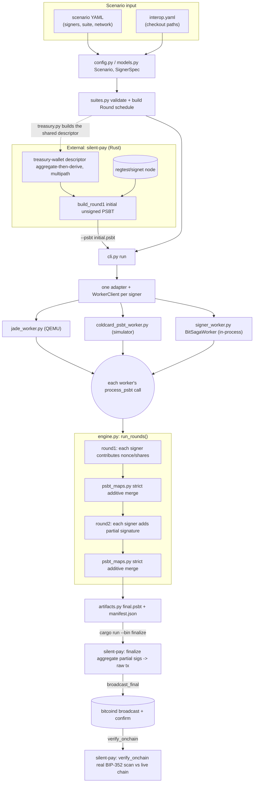

# bip375-interop

Reproducible interoperability harness for collaborative Silent Payment signing.
It deliberately separates three protocol suites:

- `bip375`: ordinary eligible inputs signed by Coldcard, Jade, or upstream SeedSigner.
- `musig2-sp`: MuSig2 inputs signed by Coldcard, Jade, or BitSaga SeedSigner.
- `frost-sp`: reserved extension point. It is recognized but rejected until its protocol
  fields, rounds, and verification rules are implemented.

The harness coordinates existing device-native tests; it does not implement signing or
silently substitute a software cosigner. Every configured participant is an independent
emulator process or a guided physical-device handoff.

## Setup

Every signer and validator is an external checkout. The harness never vendors them; it
reads their paths from `interop.yaml` (gitignored, local paths) and their pinned commits
from `interop.lock` next to it.

```sh
python3.11 -m venv .venv
. .venv/bin/activate
pip install -e '.[test]'
pip install -e <embit checkout>           # editable, or preflight fails
cp config/interop.example.yaml interop.yaml
$EDITOR interop.yaml                      # point each checkout path at your clones
bip375-interop --allow-dirty doctor       # each checkout's VCS, tip and dirty state
pytest -q
```

Per-backend prerequisites (full list in [docs/runbook.md](docs/runbook.md#prerequisites)):

| Checkout | Needs |
|---|---|
| jade | `qemu-system-xtensa` on `PATH` (or under `~/.espressif`), and a built `build/flash_image.bin` |
| coldcard | a built simulator and `<checkout>/ENV/bin/python`; on Apple Silicon Homebrew `libsecp256k1` (override with `PYSECP_SO`) |
| seedsigner | `pip install -r <seedsigner>/requirements.txt` into `.venv` |
| caravan | `npm ci && npx turbo build --filter=@caravan/psbt...` in the checkout |
| spdk | `cargo build --release` in this repo's `spdk-cli/` |
| silent-pay | `cargo`, plus `bitcoind` and `bitcoin-cli` for the MuSig2-SP regtest legs |

## Regression testing

Two configs exist:

- `interop.yaml` (repo root): your live checkouts. Use it while developing a change.
- `baseline/interop.yaml`: the stable pin. It has its own `interop.lock` and
  `expectations.yaml`, and is what "no regression" is measured against. Pass
  `--config baseline/interop.yaml` to run against it.

### After changing a repo

Run from the repo root with `.venv` active. Add `--allow-dirty` (before the subcommand)
when a checkout has uncommitted work; the result is then marked non-reproducible.

| You changed | Rebuild first | Then run |
|---|---|---|
| this harness | nothing | `pytest -q` and `bip375-interop check --project harness --exhaustive` |
| Jade | `idf.py build` and `main/qemu/make_flash_img.sh` (QEMU boots the image, not the source) | `bip375-interop check --project jade` and both `just musig2-regtest` legs |
| coldcard-firmware | the simulator, if C or build files changed | `bip375-interop check --project coldcard` and `just musig2-regtest aggregate-then-derive` |
| seedsigner | nothing | `bip375-interop check --project seedsigner` |
| embit | nothing (installed editable) | `bip375-interop check --project harness` |
| caravan | `npx turbo build --filter=@caravan/psbt...` | `bip375-interop check --project caravan` |
| spdk or rust-psbt | bump `rev` in `spdk-cli/Cargo.toml` (or `--config` override, see runbook), then `cargo build --release` in `spdk-cli/` | `bip375-interop check --project spdk`, plus both `just musig2-regtest` legs (silent-pay links them too) |
| silent-pay | nothing (`cargo run` rebuilds) | both `just musig2-regtest` legs; if initial PSBT construction changed, also both `just musig2-psbt` legs to refresh the stored PSBTs |
| bitsaga-seedsigner | nothing | no runnable scenario yet: both are MuSig2-SP and need an external PSBT |

`check --project X --dry-run` shows what would be selected, and which files changed in
that checkout since `HEAD` (`--since <rev>` for another baseline), without starting any
device.

### Full regression against the baseline

```sh
bip375-interop --config baseline/interop.yaml doctor
pytest -q
bip375-interop --config baseline/interop.yaml check --project harness --exhaustive > check.log 2>&1; echo "exit $?"
ALLOW_DIRTY=1 just musig2-regtest aggregate-then-derive
ALLOW_DIRTY=1 just musig2-regtest derive-then-aggregate
```

`check --exhaustive` takes several minutes. Redirect it to a file rather than piping it
through `tail`, which would hide its exit code. The regtest legs print `PASS` with a txid
only after the recipient's output is found on-chain. They read `interop.yaml` at the repo
root, not the baseline config; set `SILENT_PAY=<path>` to point them at another
silent-pay checkout.

`ALLOW_DIRTY=1` and `--allow-dirty` are needed on the baseline today because a built
coldcard-firmware checkout always carries an uncommitted `bech32.patch`, and the
silent-pay and spdk baseline worktrees carry path patches (see
[docs/regression-plan.md](docs/regression-plan.md#rust-psbt-an-undeclared-fourth-pin)).

### Reading the result

Each `check` writes `report.json` and `report.html` under `artifacts/batches/<timestamp>-<project>-<id>/`
and prints only the variances against `expectations.yaml` and the previous batch of the
same project.

| Exit | Meaning |
|---|---|
| 0 | everything matches expectations, including expected findings |
| 1 | a `REGRESSION`, `UNCLASSIFIED` or `NEW` case, or every selected scenario was blocked |
| 2 | preflight or configuration failure; nothing ran |

`FIXED` or `CHANGED` means a scenario moved; update `expectations.yaml` with the
evidence. Full label table:
[docs/runbook.md](docs/runbook.md#expectations-and-labels).

### Stored MuSig2-SP PSBTs

`check` can't build a MuSig2-SP initial PSBT itself, so one is committed next to each
2-of-2 scenario (`scenarios/<name>.psbt`) and bound automatically. `--psbt
SCENARIO=PATH` overrides it, and `check --dry-run` shows which PSBT each case will use.
A MuSig2-SP scenario with no stored PSBT (`musig2-sp-three-way`,
`musig2-sp-signet-treasury`) stays blocked.

`check` only runs the signing rounds, so a bound case reports `completed`: nothing is
finalized or broadcast. The `just musig2-regtest` legs remain the end-to-end proof.

Regenerate a stored PSBT after a silent-pay, `treasury.py` or test-seed change, from the
pinned silent-pay:

```sh
SILENT_PAY=<silent-pay checkout> BITCOIND=<bitcoind> just musig2-psbt aggregate-then-derive
SILENT_PAY=<silent-pay checkout> BITCOIND=<bitcoind> just musig2-psbt derive-then-aggregate
```

The funding is deterministic (regtest coinbase to the treasury), but silent-pay shuffles
output order as BIP-375 recommends, so a rebuild can swap the recipient and change
outputs. Both orders are valid; commit a rebuilt PSBT only when its content should change.

### Moving the baseline

When a change is accepted upstream, move the pin and its expectations in one commit:

```sh
bip375-interop --config baseline/interop.yaml pin    # refuses dirty checkouts
bip375-interop --config baseline/interop.yaml check --project harness --exhaustive
# edit baseline/expectations.yaml for every FIXED/CHANGED case, then commit both files
```

### Running one scenario

```sh
bip375-interop plan scenarios/<name>.yaml                    # round and signer schedule
bip375-interop run-generated scenarios/<name>.yaml           # bip375 suite, fixture built in-process
bip375-interop run scenarios/<name>.yaml --psbt initial.psbt # musig2-sp suite, PSBT from silent-pay
bip375-interop smoke jade                                    # single-device transport check
```

Per-scenario status, findings and the manual MuSig2-SP recipe are in
[docs/runbook.md](docs/runbook.md).

## Architecture

### Key components

- **`cli.py`** -- entry point (`bip375-interop`). Loads config and scenario, validates
  against the declared suite, starts one adapter/worker per signer, drives the round
  schedule, and writes the run manifest. Also hosts the standalone `treasury-wallet`,
  `smoke`, `doctor`, `validate`, and `plan` commands.
- **`config.py` / `models.py`** -- parse `interop.yaml` (checkout paths, artifact root)
  and a scenario YAML (`Scenario`, `SignerSpec`) into typed, validated dataclasses.
- **`suites.py`** -- the suite registry (`bip375`, `musig2-sp`, reserved `frost-sp`).
  Owns suite-specific config validation (`Bip375Config`, `Musig2SpConfig`) and turns a
  validated scenario into an ordered list of `Round`s (e.g. musig2-sp's
  `(round1, all signers), (round2, all signers)`). This is the one place that knows
  which suite needs which protocol phases.
- **`engine.py`** -- suite-agnostic round orchestration. `run_rounds()` walks the round
  schedule, sends the current PSBT to each signer's worker in turn, and folds the
  response back in. Knows nothing about MuSig2, Silent Payments, or any specific device.
- **`psbt_maps.py`** -- dependency-light PSBTv2 parser and **strict, additive merge**.
  A signer's contribution may only add new records or clear an authorized flag; any
  attempt to mutate or remove an existing field raises `PsbtMergeError`. This is the
  harness's core security boundary between untrusted signer contributions.
- **`worker.py`** (`WorkerClient`) -- persistent JSON-lines transport to one signer
  process. Owns process lifecycle: starts each worker in its own process group and
  signals the whole group on `stop()`, so a device's QEMU/simulator child can't outlive
  the harness run.
- **Device workers** -- one persistent process per backend, all speaking the same
  `{capabilities, process_psbt}` JSON-lines protocol:
  - `jade_worker.py` -- owns one Jade QEMU instance + `jadepy` connection.
  - `coldcard_psbt_worker.py` -- owns one headless, segregated Coldcard simulator.
  - `signer_worker.py` -- in-process library workers: `BitSagaWorker` (MuSig2-SP via
    bitsaga-seedsigner's `musig2_psbt.Session`) and an upstream-SeedSigner BIP-375
    worker.
- **`adapters/`** -- one adapter per backend (`jade.py`, `coldcard.py`, `bitsaga.py`,
  `seedsigner.py`), each planning the exact subprocess command/environment for its
  worker and declaring its own build/test/native-suite commands. `coldcard_worker.py`
  is the native-suite variant (Milestone 1): runs a backend's own upstream test suite
  in a disposable checkout copy rather than the persistent PSBT protocol.
- **Validators** -- Caravan and SPDK re-check PSBT snapshots and never sign.
  They are the release-gate validators. A scenario may list them under
  `validators:`, `check --exhaustive` attaches both to every bip375 scenario,
  and `check --release` does that and also runs both MuSig2 regtest
  architectures. `check --project caravan` selects the scenarios that name it.
  `verify_bip375_completion` is not this check: it uses embit.
- **`treasury.py`** / **`fixtures.py`** -- PSBT/descriptor construction. `treasury.py`
  derives a shared MuSig2 treasury descriptor from the harness's own published test
  seeds (`test_seeds.py`), in either key architecture -- **aggregate-then-derive**
  (`tr(musig(A,B)/<0;1>/*)`) or **derive-then-aggregate**
  (`tr(musig(A/<0;1>/*,B/<0;1>/*))`) -- mirroring silent-pay's own
  `descriptor_from_signers` byte for byte, since the architecture is inferred purely
  from where the multipath step lands. A scenario's declared `key_architecture` picks
  the shape. `fixtures.py` generates unresolved plain BIP-375 fixtures in-process
  (musig2-sp fixtures are not yet generated this way -- those PSBTs come from
  silent-pay instead, see below).
- **`artifacts.py`** -- writes every intermediate and final PSBT, plus a hash manifest,
  to one timestamped directory per run under `artifacts/`.
- **External, not part of this repo**: `silent-pay` (Rust) builds real MuSig2-SP
  treasuries and initial PSBTs against a live node, and finalizes/broadcasts/verifies
  the fully-signed result on-chain; `coldcard-firmware`, `Jade`, `seedsigner`, and
  `bitsaga-seedsigner` are the actual signer implementations this harness drives and
  never reimplements.

### Data flow

The MuSig2-SP path (the fullest one this harness has run end to end); plain BIP-375
follows the same shape minus the treasury/finalize steps, using `fixtures.py` in place
of silent-pay for the initial PSBT.



## Design boundaries

Scenario YAML contains common signer/input/output intent and a suite-specific block.
Adapters own device lifecycle and transport. Coldcard's per-PSBT path is
`coldcard_psbt_worker.py`. Mixed Coldcard/Jade runs are in the scenario catalog;
they are not future work. Suites own round sequencing and protocol verification.
MuSig2 nonce handling and descriptor rules therefore do not leak into the plain
BIP-375 or future FROST suites.

A run manifest records `verification_scope`. Three labels, and only these:

| Scope | Meaning | Implemented by |
|---|---|---|
| `evidence` | Full bip375 crypto checks ran, scenario intent was bound, and both release-gate validators checked snapshots. | `verify_bip375_completion` (embit: `derive_sp_outputs`, `schnorr_verify`, `verify_dleq_proof`) plus intent binding in that function, then Caravan (`adapters/caravan.py`, every `*.psbt`) and SPDK (`adapters/spdk.py`, `final.psbt`, rust-psbt). Written only when those validators ran. |
| `interop-only` | The round completed, but this process did not bind scenario intent (`consistency-only`) or did not check MuSig2 aggregation (`structural-musig2`). | `run_claim` / `verify_musig2_sp_completion` count `0x1b` / `0x1c` records only. Aggregation, broadcast, and the on-chain scan are `scripts/musig2-regtest.sh` (silent-pay), which `check --release` runs for both key architectures. A leg counts only when that script prints `PASS`. |
| `not-evidence` | `verification: structural`, `merge_policy: combiner` or a recorded repair, or a skipped validator. Not a pass. | `run_claim`. A tight `run` / `run-generated` loop may skip validators; the manifest then says `independent_check: not-run` and the scope is not `evidence`. |

embit is a second implementation relative to Coldcard and Jade firmware. It is not Caravan and it is not rust-psbt. Do not read a harness completion check as an independent oracle unless the release-gate validators ran.

Each run writes an isolated artifact directory containing the input and output from every
signer, semantic checks, logs, and a hash manifest. Native checkout paths are inputs, not
scratch space. Builds and fixture overlays belong in harness-managed temporary/cache
directories.

## Known issues

- TODO: SeedSigner's pinned embit fork ignores each input's own
  `PSBT_IN_SIGHASH_TYPE` when signing a BIP-376 sp-spend input
  (`SilentPaymentsPSBT._sign_sp_spends` / `sign_input_with_sp_tweak` never
  passes the input's declared sighash through, unlike the ordinary per-input
  `PSBT.sign_with` path, which does). It always signs SIGHASH_DEFAULT
  regardless of what the PSBT requests. Harmless on-chain (DEFAULT and ALL are
  consensus-equivalent for taproot), but worth reporting upstream to
  SeedSigner/embit.
