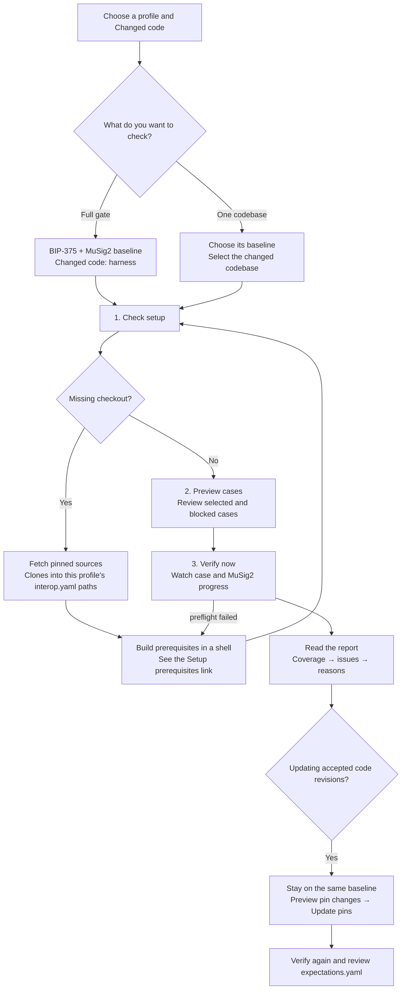

```mermaid
flowchart TD
    A["Choose a profile and Changed code"] --> B{"What do you want to check?"}
    B -->|"Full gate"| C["BIP-375 + MuSig2 baseline<br/>Changed code: harness"]
    B -->|"One codebase"| D["Choose its baseline<br/>Select the changed codebase"]
    C --> E["1. Check setup"]
    D --> E
    E --> F{"Missing checkout?"}
    F -->|Yes| G["Fetch pinned sources<br/>Clones into this profile's interop.yaml paths"]
    G --> H["Build prerequisites in a shell<br/>See the Setup prerequisites link"]
    H --> E
    F -->|No| I["2. Preview cases<br/>Review selected and blocked cases"]
    I --> J["3. Verify now<br/>Watch case and MuSig2 progress"]
    J -->|"preflight failed"| H
    J --> K["Read the report<br/>Coverage → issues → reasons"]
    K --> L{"Updating accepted code revisions?"}
    L -->|Yes| M["Stay on the same baseline<br/>Preview pin changes → Update pins"]
    M --> N["Verify again and review expectations.yaml"]
```
